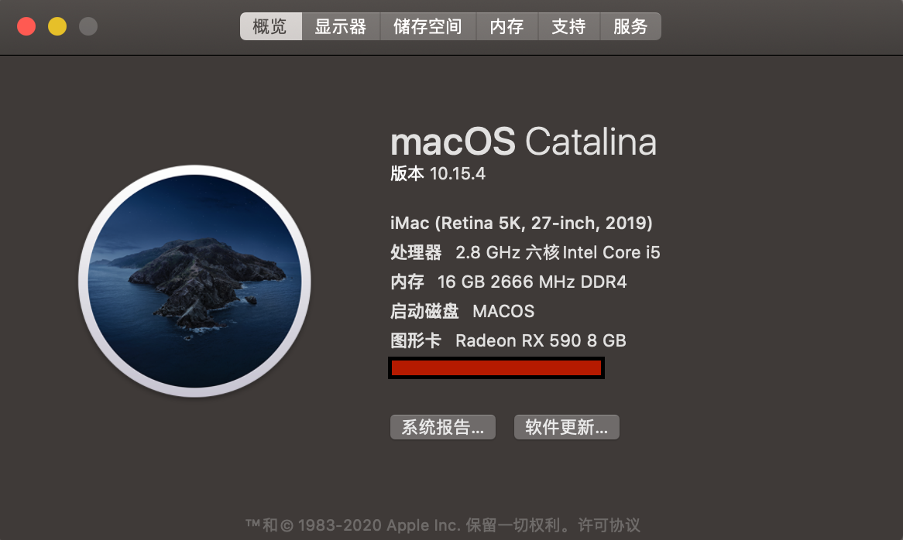
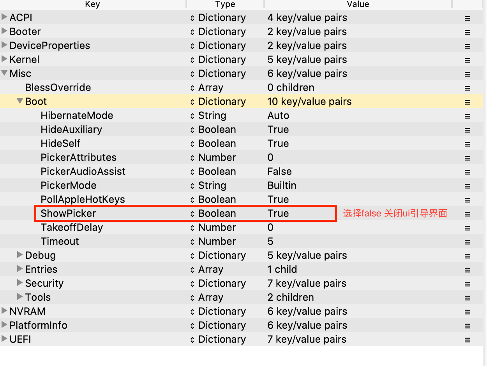

# opencore-i5-8400-ASUS-B360M-PLUS-RX590-EFI
基本完美驱动mac 10.15.4 持续更新

### 更新记录
- 2020/03/25 暂无  

### 说明
- 开启了 -v 啰嗦模式，和ui界面。方便调试。  
- 建议可以引导后，在选择系统界面用 ctrl+enter 来锁定默认系统然后直接关闭ui界面，开机直接进入苹果系统，感受接近原声的体验。如果想进window Mac下的启动磁盘可以直接进，但是建议直接开机的时候按F8选择win引导进入  
- 
